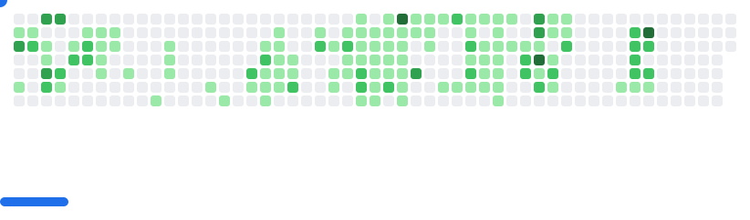

# 🌟 GitHub PROFILE

<div align="center">
  <!-- Animated Header Banner -->
  
</div>

<div align="center">
  
  <!-- Animated Typing Effect -->
  
  
</div>

---

## 👨‍💻 About Me


- 🔭 Currently working on **Portfolio**, **SNE Portal**, **Wamumbi** and private projects
- 🌱 Learning **Pro Frontend/Backend Development** at **ALX**
- 🎯 **2025 Goals:** Master full-stack development and contribute to open source
- ⚡ **Fun fact:** I solve algorithmic puzzles and play chess in my free time
- 😄 **Pronouns:** He/Him
- 💬 Ask me about **Web Development**, **Algorithms**, **Chess Strategy**

<br clear="right"/>

> *"Code is like humor. When you have to explain it, it's bad."* - Cory House

---

## 🤝 Connect With Me

<div align="center">


[](https://your-portfolio-link.com)
[](https://twitter.com/Lewis_Magangi)
[](https://linkedin.com/in/lewis-magangi)
[](https://instagram.com/Liquelaliqour)

[](https://github.com/LewisMagangi)
[](https://github.com/LewisMagangi)

</div>

---

## 🚀 Featured Projects

<div align="center">

| Project | Description | Tech Stack | Links |
|---------|-------------|------------|-------|
| 🏠 **Portfolio** | Personal portfolio showcasing my work (coming soon) | React, TypeScript, Tailwind | — |
| 💧 **Solar Powered Water ATM System** | Python-based web app for secure, sustainable water access via solar-powered dispensing units | Django, Python, Flask, REST API, IoT, SQL | [](https://github.com/LewisMagangi/solar-water-atm) |
| 🐟 **Sustainable Fishing Platform** | Modular Django platform for community-driven sustainable fishing | Django, Python, SQLite, HTML5, CSS3, JS | [](https://sustainablefishing.onrender.com/content/home/) [](https://github.com/LewisMagangi/sustainable-fishing) |
| 🔐 **Cryptography Web App** | Django-based platform for cryptographic analysis and visualization | Django, Python, REST API, Cryptography, SQLite | [](https://github.com/LewisMagangi/cryptography-web-app) |
| 🌍 **Wamumbi Web Platform** | Modern full-stack app with Next.js & TypeScript | Next.js, React, TypeScript, Prisma, PostgreSQL, Tailwind | [](https://wamumbi.vercel.app/) [](https://github.com/LewisMagangi/wamumbi) |
| 🩺 **Afya Bora** | Django web app for health & wellness community | Django, Python, SQLite, HTML, CSS | [](https://github.com/LewisMagangi/afya-bora) |
| 🗣️ **SNE Portal** | Advanced web portal for secure online voice exams | Django, Python, Whisper, Coqui TTS, Selenium | [](https://sneportal.onrender.com/) [](https://github.com/LewisMagangi/sneportal) |

</div>

<div align="center">
  <a href="https://github.com/LewisMagangi?tab=repositories">
    
  </a>
</div>

---

## 🛠️ Tech Stack & Tools

<div align="center">

### Languages


### Frameworks & Libraries


### Databases & Cloud


### DevOps & Tools


</div>

---

## 🏆 Coding Profiles & Gaming

<div align="center">

### 💻 Competitive Programming
[](https://codeforces.com/profile/Liquelaliqour)
[](https://leetcode.com/u/LewisMagangi/)
[](https://www.codewars.com/users/Liquelaliqour)

### ♟️ Chess Profiles
[](https://lichess.org/@/Lique)
[](https://www.chess.com/member/Liquelaliqour)

</div>

---

## 📊 GitHub Analytics

<div align="center">
  
  
</div>

<div align="center">
  
</div>

<div align="center">
  
</div>

---

## 🎯 What I'm Up To

<div align="center">

```javascript
const lewisCurrently = {
    code: ["JavaScript", "TypeScript", "Python", "Django"],
    askMeAbout: ["Web Development", "Algorithms", "Chess Strategy", "Tech Career"],
    technologies: {
        frontEnd: {
            js: ["React", "Next.js"],
            css: ["Tailwind", "Bootstrap"]
        },
        backEnd: {
            python: ["Django", "Flask"],
            js: ["Node", "Express"]
        },
        databases: ["PostgreSQL", "MySQL", "MongoDB", "SQLite"],
        misc: ["Docker", "REST APIs", "GraphQL"]
    },
    architecture: ["Microservices", "Event-Driven", "Design System Pattern"],
    currentFocus: "Building scalable full-stack applications",
    funFact: "I debug code faster when listening to music 🎵"
};
```

</div>

---

## 🏅 Achievements & Certifications

<div align="center">


[](https://badges.pufler.dev)
[](https://badges.pufler.dev)
[](https://badges.pufler.dev)

</div>

---

## 🎮 Interactive GitHub Games

<div align="center">

### 🧱 Play Breakout with My Contributions!


<picture>
  <source
    media="(prefers-color-scheme: dark)"
    srcset="Images/breakout-dark.svg"
  />
  <source
    media="(prefers-color-scheme: light)"
    srcset="Images/breakout-light.svg"
  />
  
</picture>

<!-- Snake Game (Hidden) -->
<!-- ### 🐍 Watch the Snake Eat My Contributions! -->
<!-- *This animated snake devours my GitHub contribution squares in real-time* -->
<!--  -->

</div>

---

<div align="center">
  
  ### 💭 Random Dev Quote
  
  
</div>

---

<div align="center">
  <!-- Footer Wave -->
  
  
  ### 🚀 "Happy Coding!" 
  
  **Thanks for visiting my profile! Let's connect and build something amazing together!**
  
</div>