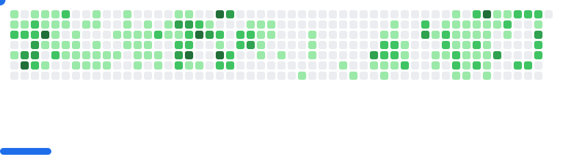

#### Hi there 👋, I'm Lewis Magangi

- 🔭 I’m currently working on a Backend Web Specilazation and Mobile Development. 
- 🌱 I’m currently learning Web Development.
- 😄 Pronouns: He / Him

### Let's Connect :

  

  

### 🧰 Languages  
  
  
  
  
  

   

### 🛠️ Tools  
  
  
  
  
  
  
  
  
  

   

### 🖥️ Frontend  
  
  

   

### 🔗 Backend  
  
  
  
  
  

   

### 💾 Databases  
  
  
  

   

### ⚙️ Web Servers  
  
  

   

### 🧪 Testing  
  
  

 

#

##  Stats

## Top Languages

## Streaks

[twitter]: https://twitter.com/Lewis_Magangi
[instagram]: https://instagram.com/Liquelaliqour
[linkedin]: https://linkedin.com/in/lewis-magangi

### 🎮 Play Breakout with My GitHub Contributions!
<picture>
  <source
    media="(prefers-color-scheme: dark)"
    srcset="Images/breakout-dark.svg"
  />
  <source
    media="(prefers-color-scheme: light)"
    srcset="Images/breakout-light.svg"
  />
  
</picture>

*This interactive Breakout game is generated from my actual GitHub contribution graph! The blocks represent my coding activity throughout the year.*